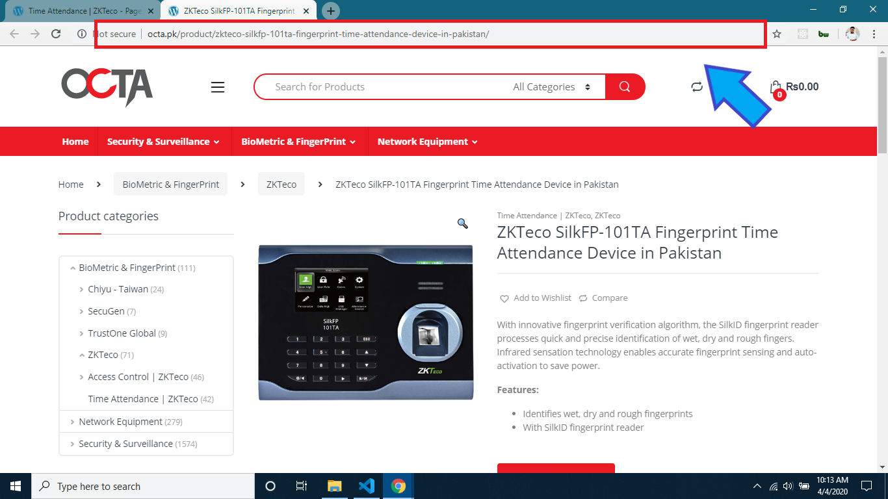

# Node GUI Based Web Scraper 

A script written in NodeJS for crawling and extracting structured data from e-commerce websites for different purposes.

## User Guide

### Installation

- Clone or download the repository 
- run this command for installing the dependencies `npm install`
- run this command for using the app `npm start`
- you can access the app on port `8080` 
    - open your browser and go to `localhost:8080` for accessing the app

### Getting Started

Below is your step by step guide to using the application for crawling the web pages

#### 1. Enter Website URL (Product Catalog Page)

You are requested to enter url of the webpage which contains the products. Below is the graphical example of the url you need to enter

#### 2. Enter Website Second Page URL (Product Catalog Second Page)

You are requested to enter url of the second webpage which contains the products.We'll use this URL for recognizing paths. Below is the graphical example of the url you need to enter

#### 3. Enter Individual Product URL

You are requested to enter any product URL so that we can open it for you to choose the details you want to scrape.

#### 4. Enter Brand Name

You are requested to enter any brand name, we'll use this for naming your metadata.

#### 5. Choose Main Container

You are requested to click the button which is in that field for choosing main container (which contains all the prducts)

#### 6. Choose Individual Product

You are requested to click the button which is in that field for choosing individual product

#### 7. Choose Product Images

You are requested to click the button which is in that field for choosing product images

#### 8. Enter Column Name

We've added this for you so that you can enter the fields or columns or data you want to scrap from website,
all you have to do is just enter the field name press enter a new text element will be generated automatically, Now do the same process for choosing elements you want to scrape 

#### 9. Check Metadata [optional]

We've added this for your ease that so that you can see the data of the elements which you've selected if there's any changing you can do this right-away.

#### 10. Save Metadata

You are requested to click this button when you are done will all that, it will create a metadata file of the things which you've selected or choosen so far.

#### 11. Upload Metadata

You are requested to upload metadata, so that the server load the data which you want to scrape.

#### 12. Scraping Products

- Enter start page of the website
- Enter end page of the website
- Click on scrap products to `start scraping`

#### 13. Viewing data

Click on the View data button to show the data which is scraped from the website when it will be done

#### 14. Exporting data

click on the `Generate CSV` button to download the scraped data